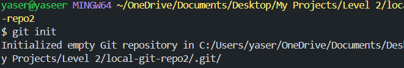
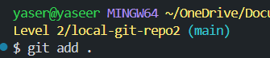
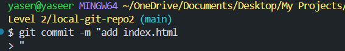
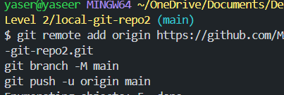
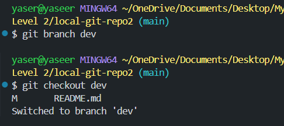
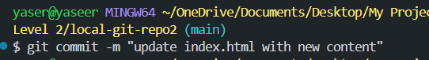
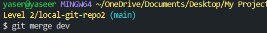
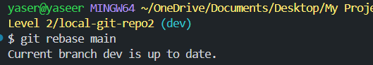

# Part 1- Initialize a repository

## Image Example

# Part 2- Adding and Committing Changes
-create and add a file

## Image Example

-commit the changes

## Image Example

# Part 3- Connecting to GitHub and Pushing Changes
-Create a repository on GitHub
-Connect and Push to GitHub

## Image Example

# Part 4- Working with Branches
-Create and switch to a new branch

## Image Example

-Make changes to index.html and commit them:

## Image Example

# Part 5- Mergine and Rebasing
-Merge the Dev branch into main

## Image Example

-Rebase the dev branch onto main

## Image Example

